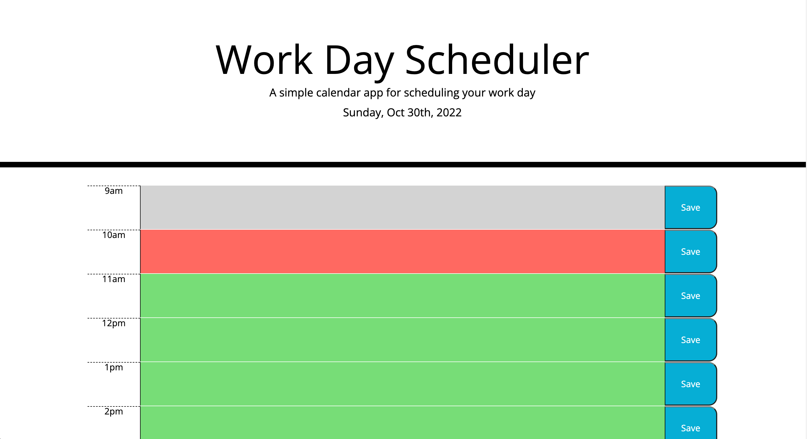

# Daily Planner Application

## Description
This project was a challenge assigned to us where we had to create a daily planner application from starter HTML and CSS code but we were not given any JavaScript starter code. 

Once you open the app, the current date is displayed at the top and you are presented with timeblocks for standard business hours. The time blocks are color coded to show the past, present, and future time. When you click on the block, you can enter event text, and when you click on the save button, the text is saved in local storage, which will save even when the page is refreshed.

In this challenge I was getting used to using jQuery in my JavaScript. With the help of a tutor, I was able to understand it more and utilize it in my code. Using local storage is starting to make more sense to me with help from TAs and tutors. I was able to have all text input areas save and remain on the page after refresh. An issue I ran into was after giving each time block an id, the timeblocks after 12 pm were being recognized as past time and were colored grey. I learned that moment recognizes 1pm to 5pm as being before 12pm so I had to use military time or the 24hour clock to name those ids. After changing the names from 13 to 17, the timeblock colors worked perfectly.

## Usage
This application can serve as daily planner and its creation was a way to practice JavaScript, jQuery, and moment.

[Link to application](https://crzn24.github.io/)

## Credits

* [Bootstrap Grid Examples](https://getbootstrap.com/docs/4.6/examples/grid/#containers)
* [textarea HTML tag](https://www.w3schools.com/tags/tag_textarea.asp)
* [jQuery Syntax](https://www.w3schools.com/jquery/jquery_syntax.asp)
* [jQuery Traversing](https://www.w3schools.com/jquery/jquery_traversing.asp)

## License

MIT License
